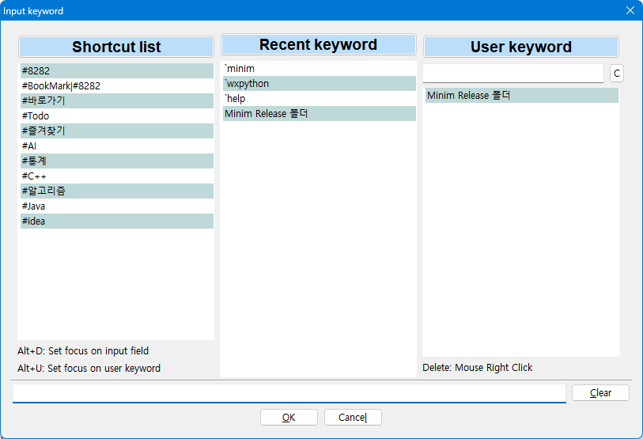

# ChoboMemo2

Simple memo & code snippet management tool

# How to use

## Shortcut keys
~~~
    Ctrl+N : Create memo
    Ctrl+E : Edit memo  
    Ctrl+U : Edit memo  
    Ctrl+D : Delete memo
    Ctrl+F : Find

    Ctrl+S : Save
    Ctrl+Q : Quit

    Ctrl+M : Notepad
    Ctrl+P : MsPaint

    Alt +P : Open URL in clipboard
 
    Ctrl+Shift+E : Edit shortcut keys
    Ctrl+Shift+I : Help    
    Ctrl+Shift+F : Simple Find

    [Advanced search]
    ![Keyword] : Find items which do not include keyword
    ~[Keyword] : Find items which do not include keyword

    `[Keyword] : Find items which have keyword in title
    t:[Keyword] : Find items which have keyword in title
    
    A,B : Find items which have A and B     
    A|B : Find items which have A or B
~~~

## Search (Ctrl+F)
* t: [Keyword] 
  - Find keyword in title only

* A and B
  - A, B
  
* A or B
  - A | B  

  
# License
MIT license
