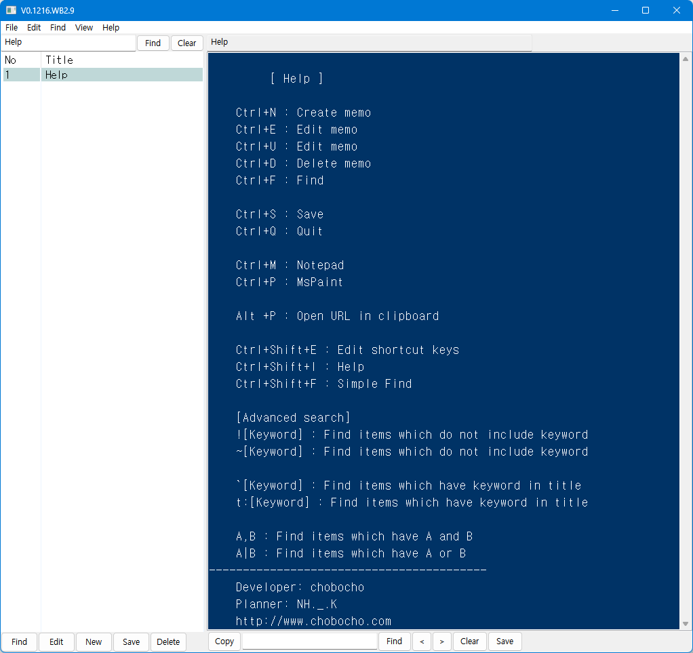

# ChoboMemo2

Simple memo & code snippet management tool

# How to use

## Shortcut keys
~~~
    Ctrl+N : Create memo
    Ctrl+E : Edit memo  
    Ctrl+U : Edit memo  
    Ctrl+D : Delete memo
    Ctrl+F : Find
    Ctrl+S : Save
    Ctrl+Q : Quit

    Ctrl+M : Notepad
    Ctrl+P : MsPaint

    Alt +P : Open URL in clipboard
~~~

## Search (Ctrl+F)
* t: [Keyword] 
  - Find keyword in title only

* A and B
  - A, B
  
* A or B
  - A | B
  
  
# License
MIT license
